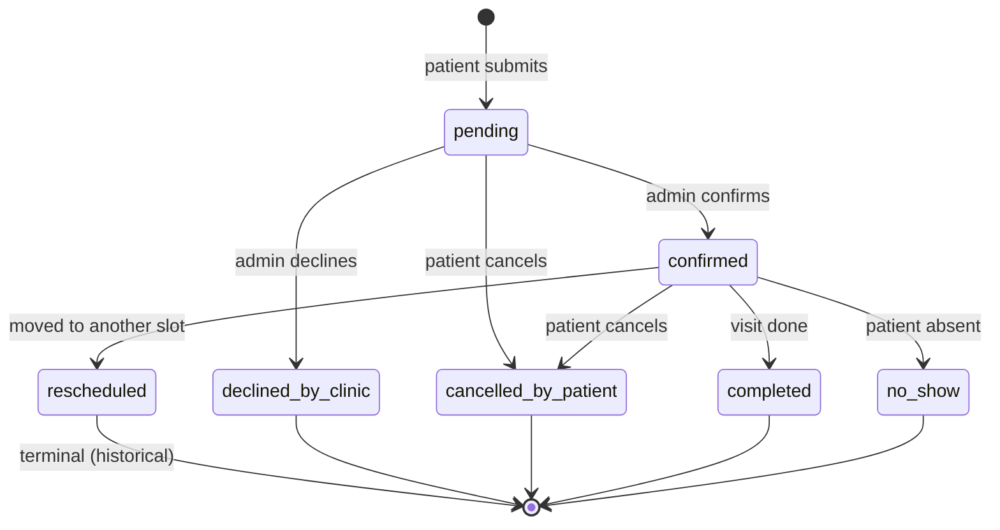

# D1 data model — drpratchaya.com

SQLite schema applied via numbered files in `migrations/`. Cloudflare D1 runs the same SQL as local `sqlite3`.

## Instant and timezone policy

| Kind | Storage | Meaning |
|------|---------|---------|
| **Instants** (`starts_at`, `ends_at`, `published_at`, `created_at`, …) | `TEXT`, UTC, ISO 8601 with `Z` suffix | e.g. `2026-09-24T03:00:00.000Z` |
| **Local calendar dates** (`valid_from`, `exception_date`) | `TEXT`, `YYYY-MM-DD` | Interpreted in **Asia/Bangkok** (UTC+7, no DST) |
| **Local wall-clock times** (`start_time`, `end_time`, closures) | `TEXT`, `HH:MM` | **Asia/Bangkok** clinic hours, no timezone suffix |

**Rule:** The database never stores “floating” local instants. Slot materialisation and cron jobs:

1. Walk each calendar day in Bangkok.
2. Apply `schedule_templates` (weekday + local time window) and subtract `schedule_exceptions` (full-day or partial local closure).
3. Emit slot boundaries as UTC `TEXT` instants for `slots.starts_at` / `slots.ends_at`.

The public UI formats those UTC values back to Bangkok for patients. Admin lists may show either; the source of truth for ordering and conflict detection is UTC text (lexicographic sort matches chronological order when the format is fixed-width).

Getting this wrong causes off-by-one-hour display or double-booking across DST boundaries; Thailand has no DST, which keeps conversion stable year-round.

## Table reference

### `locations`

One row per hospital or clinic. `booking_mode`:

- **`slots`** — site shows generated time slots and accepts booking requests.
- **`external`** — site shows `external_channel_label`, `external_phone`, `external_line_id`, and/or `external_booking_url` instead of slots. A `CHECK` requires a non-empty channel label when mode is `external`.

`ON DELETE RESTRICT` on downstream scheduling rows prevents deleting a location that still has templates, exceptions, or slots.

### `schedule_templates`

Recurring weekly availability per location: ISO weekday `1` (Monday) … `7` (Sunday), local `start_time` / `end_time`, `slot_duration_minutes`, and `valid_from` / `valid_until` (Bangkok dates) so a template can be retired without deleting history.

### `schedule_exceptions`

One-off closures or partial closures per location and `exception_date` (Bangkok). `is_full_day = 1` closes the whole day; otherwise `closure_start` / `closure_end` (local `HH:MM`) mark the closed interval. Optional `reason` (e.g. conference travel).

### `slots`

Materialised bookable intervals, generated ~8 weeks ahead by cron from templates minus exceptions. `status`:

| Value | Meaning |
|-------|---------|
| `available` | Open for booking |
| `unavailable` | Blocked (exception, past, or admin) |
| `booked` | Denormalised hint; **authoritative** occupancy is `appointments` |

Indexes support listing upcoming slots per location and by status.

### `appointments`

Patient booking request tied to one `slot_id`. No patient accounts: access via `magic_link_token` after OTP verification (OTP state lives outside D1, e.g. KV).

| Column | PDPA personal data |
|--------|-------------------|
| `patient_name`, `patient_phone`, `patient_email`, `problem_description` | Yes |
| `magic_link_token` | Yes (capability token) |
| `admin_notes` | May contain personal data if staff add it |

**Status lifecycle**



- **`pending`** / **`confirmed`** — active holds on the slot (see below).
- **`rescheduled`** — terminal for this row; the new slot should be a new appointment row (or a future migration adds `rescheduled_to_id`; out of scope today).
- Terminal statuses release the slot for another `pending`/`confirmed` booking.

`consent_log_id` links the submission to the consent version the patient accepted.

### Double-booking prevention

```sql
CREATE UNIQUE INDEX uq_slot_active ON appointments (slot_id)
  WHERE status IN ('pending', 'confirmed');
```

At most one row per `slot_id` may be `pending` or `confirmed`. A second insert/update into those statuses fails with a unique constraint error. Statuses such as `cancelled_by_patient` or `declined_by_clinic` are excluded, so the same slot can be booked again after cancellation.

This is sufficient without a Durable Object because:

- D1/SQLite serialises writes; the partial unique index is enforced atomically at commit time.
- Race: two concurrent booking requests for the same slot — one wins, the other gets a constraint failure the API maps to “slot no longer available”.
- A DO would add coordination latency and ops cost without stronger guarantees than the database already provides for this single-writer-per-slot rule.

Application code should still handle constraint failures and optionally set `slots.status = 'booked'` after confirm for UX.

### `posts` / `post_media`

CMS for **news and general articles** only. `translation_key` groups Thai/English pairs (`language` `th` | `en`). `status`: `draft`, `scheduled`, `published`. `published_at` is UTC instant when live.

`post_media` stores R2 `r2_object_key`, required `alt_text`, dimensions, `content_type`, `byte_size`. `post_id` nullable until attached.

### Why condition articles are not in D1

The four clinical condition pages under `src/content/conditions/` are **git-tracked Markdown** reviewed in PRs before publish. That matches medico-legal need for explicit doctor approval of clinical text. D1 posts are for fast-moving news and non-clinical articles admins can publish without a deploy.

### `admin_users`

Email login, `password_hash` with stored `pbkdf2_iterations` and `pbkdf2_salt` so iteration count can rise without invalidating existing hashes. Optional `totp_secret`, `is_active`, `last_login_at`.

### `audit_log`

Append-only admin actions: `action`, `entity_type`, `entity_id`, `before_json` / `after_json`, `ip_address`, `user_agent`, `created_at`. Answers “who changed this appointment?”.

### `consent_log`

Each patient-facing submission records **`consent_version`** (policy text version id), **`consented_at`** (UTC instant), **`ip_address`**, and **`consent_scope`** (what was agreed to, e.g. `booking`, `contact_form`, `newsletter`). Consent to version `v1` is not consent to `v2`; erasure/retention jobs key off these rows.

### `contact_messages`

Contact form: sender fields, `message_body`, `is_handled`, `admin_notes`, linked `consent_log_id`.

### `newsletter_subs`

Double opt-in: `status` `pending` | `confirmed` | `unsubscribed`, `confirm_token`, `unsubscribe_token`, `consent_log_id`.

### `testimonials`

Future feature. `consent_log_id` required before publish; `is_published`, `display_order`. No seed rows yet.

## PDPA: personal data and 12-month retention

Columns treated as **personal data** (erase/anonymise after the retention window unless legal hold):

| Table | Columns |
|-------|---------|
| `appointments` | `patient_name`, `patient_phone`, `patient_email`, `problem_description`, `magic_link_token`, `admin_notes` |
| `contact_messages` | `sender_name`, `sender_email`, `sender_phone`, `message_body`, `admin_notes` |
| `newsletter_subs` | `email` |
| `testimonials` | `display_name`, `story_body` |
| `consent_log` | `ip_address` (linked to identifiable submissions) |

Operational metadata (`audit_log` with admin emails in JSON, aggregate analytics) should be minimised in application code. **No** diagnoses, imaging, labs, or full medical records are modelled.

Retention jobs (not in schema) should delete or anonymise the above after **12 months** per product policy, while keeping non-identifying audit aggregates where allowed.

## Foreign-key delete behaviour (summary)

| Child | Parent | ON DELETE |
|-------|--------|-----------|
| `schedule_templates`, `schedule_exceptions`, `slots` | `locations` | RESTRICT |
| `appointments` | `slots`, `consent_log` | RESTRICT |
| `contact_messages`, `newsletter_subs`, `testimonials` | `consent_log` | RESTRICT |
| `posts` | `admin_users` | SET NULL |
| `post_media` | `posts` | SET NULL |
| `audit_log` | `admin_users` | SET NULL |

Deleting a location is blocked while slots exist; deleting slots is blocked while appointments reference them — appointments are never orphaned by location removal.

## CHECK constraints (allowed values)

| Table.column | Allowed values |
|--------------|----------------|
| `locations.booking_mode` | `slots`, `external` |
| `locations.is_active` | `0`, `1` |
| `schedule_templates.day_of_week` | `1`–`7` |
| `schedule_exceptions.is_full_day` | `0`, `1` |
| `slots.status` | `available`, `unavailable`, `booked` |
| `appointments.status` | `pending`, `confirmed`, `rescheduled`, `cancelled_by_patient`, `declined_by_clinic`, `completed`, `no_show` |
| `posts.language` | `th`, `en` |
| `posts.status` | `draft`, `scheduled`, `published` |
| `newsletter_subs.status` | `pending`, `confirmed`, `unsubscribed` |
| `admin_users.is_active` | `0`, `1` |
| `contact_messages.is_handled` | `0`, `1` |
| `testimonials.is_published` | `0`, `1` |

Plus numeric checks (`pbkdf2_iterations`, `slot_duration_minutes`, `byte_size`, non-empty `alt_text`, external booking label when mode is `external`).

## Slot materialisation (cron interaction)

1. For each active `locations` row with `booking_mode = 'slots'`, for each date in `[today, today + 8 weeks]` (Bangkok):
2. Skip or trim windows using `schedule_exceptions`.
3. For the weekday, find active `schedule_templates` (`valid_from` ≤ date ≤ `valid_until` or null).
4. Split `[start_time, end_time)` into steps of `slot_duration_minutes`.
5. `INSERT` missing `slots` with UTC `starts_at`/`ends_at`; mark overlaps with exceptions as `unavailable`.
6. Do not delete slots that already have appointment history; cron may mark past slots `unavailable`.

External locations skip slot generation entirely.

## Migrations layout

| File | Concern |
|------|---------|
| `0001_pragmas.sql` | `foreign_keys` |
| `0002_admin_and_compliance.sql` | `admin_users`, `consent_log`, `audit_log` |
| `0003_locations_and_scheduling.sql` | `locations`, templates, exceptions |
| `0004_slots.sql` | `slots` |
| `0005_appointments.sql` | `appointments` + partial unique index |
| `0006_content.sql` | `posts`, `post_media` |
| `0007_contact_newsletter_testimonials.sql` | contact, newsletter, testimonials |
| `0008_seed_placeholder_locations.sql` | fictional TODO(owner) locations + sample template/slot |
